<script type="text/javascript" src="http://cdn.mathjax.org/mathjax/latest/MathJax.js?config=default"></script>
<style type="text/css">  
div{
  text-align: justify;
}
p{font-family:"Computer Modern", Times, serif;font-size:18px;}
h1 {font-family:"Computer Modern", Times, serif;color:#009999;}
h2,h3{font-family:"Computer Modern", Times, serif;color:#70DB93;}
h4,h5,h6{font-family:"Computer Modern", Times, serif;color:#0C5AA6;}
</style>

#OVERFITTING
###What is overfitting
Overfitting literally means "Fitting the data more than is warranted." The main case of overfitting is when you pick the hypothesis with lower $E_{in}$, and it results in higher $E_{out}$ . This means that Ein alone is no longer a good guide for learning. 

>_Classic overfitting_: simple target with excessively complex $H$.
>$E_{in} ≈ 0; E_{out} ≫ 0$

Here is an example of overfitting:

<figure class="half">
    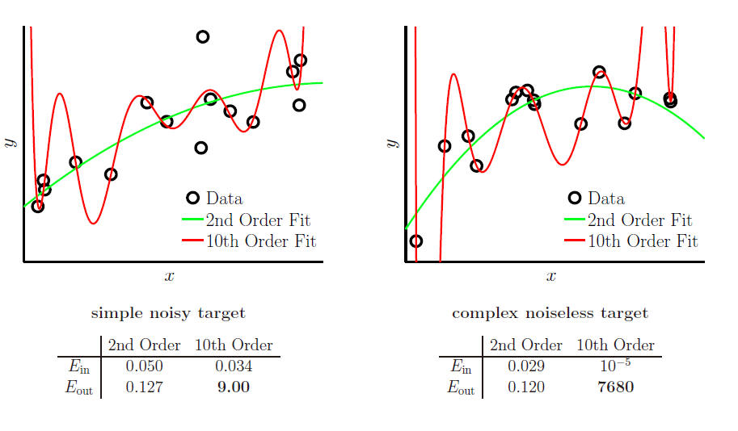
    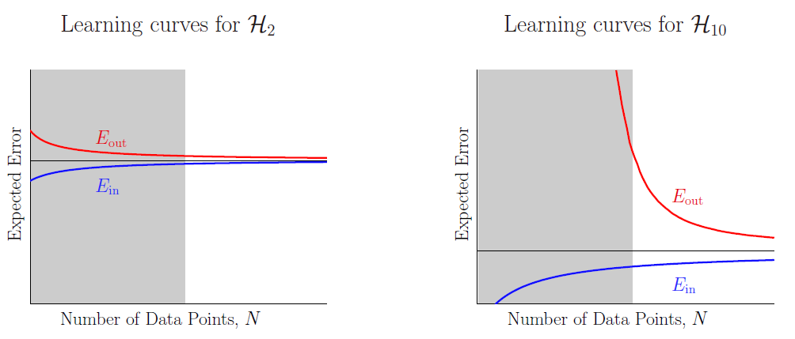
</figure>

We conclude that:

|||
|:-----:|:-------:|
|Number of data points ↑| Overfitting ↓|
|Noise ↑| Overfitting ↑|
|Target complexity ↑| Overfitting ↑|

#####Two types of noise
<figure class="half">
    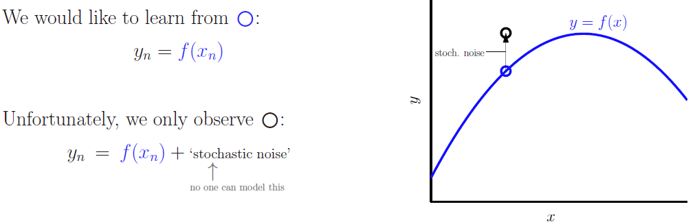
    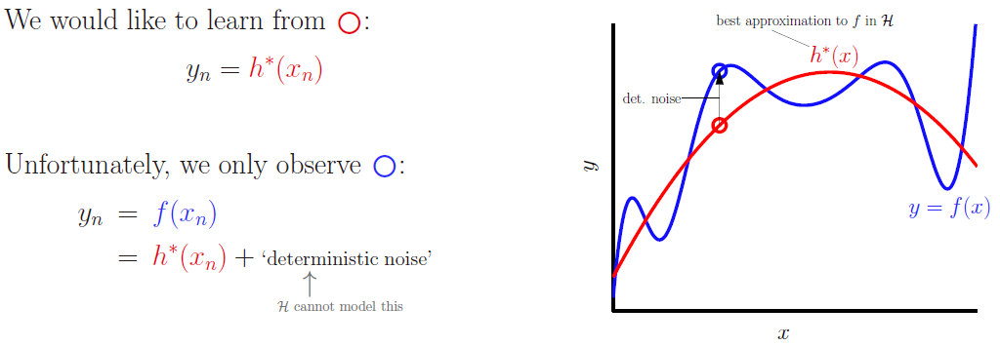
</figure>

######Stochastic Noise — Data Error
>Stochastic Noise: fluctuations/measurement errors we cannot model.Re-measure $y_n$ stochastic noise changes. change $H$ stochastic noise the same.
######Deterministic Noise — Model Error
>Deterministic Noise: the part of $f$ we cannot model.re-measure $y_n$ deterministic noise the same. change $H$ deterministic noise changes.

Using the bias and variance decomposition view we have:
$$E_D[E_{out}] = \sigma^2 + bias + var $$
The first two terms reflect the direct impact of the stochastic and determin­istic noise. The variance of the stochastic noise is $\sigma^2$ and the bias is directly related to the deterministic noise in that it captures the model's inability to approximate $f$. The var term is indirectly impacted by both types of noise, capturing a model's susceptibility to being led astray by the noise. 

###How to fix it!
####Regularization
#####Using the soft cinstraint

Don’t set weights explicitly to zero (eg $w_3 = 0$).Give a budget and let the learning choose.
$$\sum_{q=0}^{Q}w_q^2 \le C$$
Then $w_{reg}$ is a solution to
$$min\ : E_{in}(w) = \frac{1}{N}(Zw − y)^T(Zw − y)\\
subject\ to: w^Tw ≤ C$$

Observations:

1. Optimal $w$ tries to get as ‘close’ to wlin as possible.
Optimal $w$ will use full budget and be on the surface $w^Tw = C$.
2. Surface $w^Tw = C$, at optimal w, should be perpindicular to $∇E_{in}$.
Otherwise can move along the surface and decrease $E_{in}$.
3. Normal to surface $w^Tw = C$ is the vector $w$.
4. Surface is ⊥ $∇E_{in}$; surface is ⊥ normal.
$∇E_{in}$ is parallel to normal (but in opposite direction).
<figure class="half">
    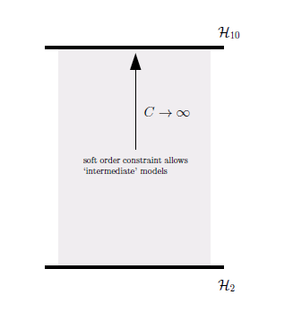
    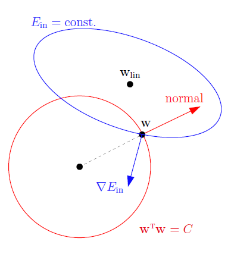
</figure>
Then problem can be changed to:
$$min: E_{aug}(w) = E_{in}(w) + \lambda_C w^Tw$$

>How does regularization work:  
>>*Stochastic noise* $−→$ nothing you can do about that.  
>>*Good features* $−→$ helps to reduce deterministic noise.  
>*Regularization*: Helps to combat what noise remains, especially when N is small.
>Typical modus operandi: sacrifice a little $bias$ for a huge improvement in $var$.
>VC angle: you are using a smaller H without sacrificing too much Ein
 
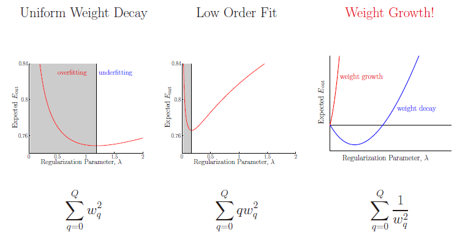

The first encourages all weights to be small, uniformly; the second pays more
attention to the higher order weights, encouraging a lower order fit.In the shaded region, $E_{out}$ increases as you decrease $E_{in}$ (decrease $\lambda$) - the regularization parameter is too small and there is not enough of a constraint on the learning, leading to decreased performance because of overfitting. In the unshaded region, the regularization parameter is too large, over-constraining the learning and not giving it enough flexibility to fit the data, leading to decreased performance because of underfitting.

Even though we don't know either the target function or the noise, regularization helps by reducing the impact of the noise. Most common models have hypothesis sets which are naturally parameterized so that smaller parameters lead to smoother hypothe­ses. Thus, a weight decay type ofregularizer constrains the learning towards smoother hypotheses. This helps, because stochastic noise is 'high frequency' (non-smooth). Similarly, deterministic noise ( the part of the target function which cannot be modeled) also tends to be non-smooth. Thus, constraining the learning towards smoother hypotheses 'hurts' our ability to overfit the noise more than it hurts our ability to fit the useful information. These are empirical observations, not theoretically justifiable statements. 

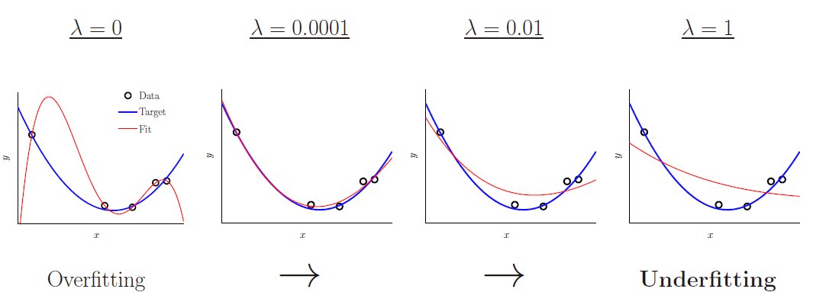
#####Lasso&Ridge regularization

######Introduction
Prior to lasso, the most widely used method for choosing which covariates to include was stepwise selection, which **only improves prediction accuracy in certain cases, such as when only a few covariates have a strong relationship with the outcome.** However, in other cases, it can make prediction error worse. Also, at the time, ridge regression was the most popular technique for improving prediction accuracy. Ridge regression improves prediction error by shrinking large regression coefficients in order to reduce overfitting, but it does not perform covariate selection and therefore does not help to make the model more interpretable.

**Lasso** is able to achieve both of these goals by forcing the sum of the absolute value of the regression coefficients to be less than a fixed value, which __forces certain coefficients to be set to zero__, effectively choosing a simpler model that does not include those coefficients. This idea is similar to **ridge regression**, in which the sum of the squares of the **coefficients is forced to be less than a fixed value**, though in the case of ridge regression, this only shrinks the size of the coefficients, **it does not set any of them to zero.**

######General form
Lasso regularization can be extended to a wide variety of objective functions such as those for generalized linear models, generalized estimating equations, proportional hazards models, and M-estimators in general, in the obvious way.[1][3] Given the objective function

$$\frac {1}{N}\sum _{i=1}^{N}f(x_{i},y_{i},\alpha ,\beta )$$
the lasso regularized version of the estimator will be the solution to
$$\min _{\alpha ,\beta }{\frac {1}{N}}\sum _{i=1}^{N}f(x_{i},y_{i},\alpha ,\beta ){\text{ subject to }}\|\beta \|_{1}\leq t$$
where only $\beta$  is penalized while  $\alpha$  is free to take any allowed value, just as $\beta _{0}$ was not penalized in the basic case.

Consider a sample consisting of N cases, each of which consists of p covariates and a single outcome. Let $y_{i}$ be the outcome and $x_{i}:=(x_{1},x_{2},\ldots ,x_{p})^{T}$ be the covariate vector for the ith case. Then the objective of lasso is to solve.
It can be helpful to rewrite
$$\min _{\beta \in \mathbb {R} ^{p}}\left\{{\frac {1}{N}}\left\|y-X\beta \right\|_{2}^{2}\right\}{\text{ subject to }}\|\beta \|_{1}\leq t.\ \  Lasso$$
$$\min _{\beta \in \mathbb {R} ^{p}}\left\{{\frac {1}{N}}\left\|y-X\beta \right\|_{2}^{2}\right\}{\text{ subject to }}\|\beta \|_{2}\leq t.\ \  Ridge$$
in the so-called Lagrangian form

$$\min _{\beta \in \mathbb {R} ^{p}}\left\{{\frac {1}{N}}\left\|y-X\beta \right\|_{2}^{2}+\lambda \|\beta \|_{1}\right\}\ \ Lasso$$
$$\min _{\beta \in \mathbb {R} ^{p}}\left\{{\frac {1}{N}}\left\|y-X\beta \right\|_{2}^{2}+\lambda \|\beta \|_{2}\right\}\ \ Ridge$$
where the exact relationship between {\displaystyle t} t and {\displaystyle \lambda } \lambda  is data dependent.

######Geometric interpretation
As discussed above, lasso can set coefficients to zero, while ridge regression, which appears superficially similar, cannot. This is due to the difference in the shape of the constraint boundaries in the two cases. Both lasso and ridge regression can be interpreted as minimizing the same objective function

$$\min _{\beta _{0},\beta }\left\{{\frac {1}{N}}\left\|y-\beta _{0}-X\beta \right\|_{2}^{2}\right\}$$
but with respect to different constraints:$\|\beta \|_{1}\leq t$ for lasso and $\|\beta \|_{2}^{2}\leq t$ for ridge. From the figure, one can see that the constraint region defined by the $\ell ^{1}$ norm is a square rotated so that its corners lie on the axes (in general a cross-polytope), while the region defined by the  $\ell ^{2}$ norm is a circle (in general an n-sphere), which is rotationally invariant and, therefore, has no corners. As seen in the figure, a convex object that lies tangent to the boundary, such as the line shown, is likely to encounter a corner (or in higher dimensions an edge or higher-dimensional equivalent) of a hypercube, for which some components of $\beta$  are identically zero, while in the case of an n-sphere, the points on the boundary for which some of the components of $\beta$  are zero are not distinguished from the others and the convex object is no more likely to contact a point at which some components of $\beta$ are zero than one for which none of them are.


####Validation
#####Validation set
`Two goals of validation set:`

* `The primary goal` is to get the best possible hypothesis, so we should out­put $g$, the hypothesis trained on the **en­tire set** $V$.
* `The secondary goal` is to esti­mate $E_{out}$, which is what validation allows us to do. Based on our discussion of learn­ing curves, $E_{out} (g) \le E_{out} (g^-)$.


`Differnence between validation set and test set:`

Regularization attempts to minimize $E_{out}$ by working through the equation and concocting a heuristic term that emulates the penalty term. Validation, on the other hand, cuts to the chase and estimates the out-of-sample error directly. 
$$E_{out}(g) = E_{in}(g) + \textbf{overfit penalty}\ \  \text{Regularization}$$
VC bounds this using a complexity error bar for H regularization estimates this through a heuristic complexity penalty for g.
$$\textbf{Eout(g)} = E_{in}(g) + \text{overfit penalty}.\ \ \text{Validation}$$
validation estimates this directly

>There is a difference between a validation set and a test set.
>Although the validation set will not be directly used for training, it will be
>used in making certain choices in the learning process. The minute a set affects
>the learning process in any way, it is no longer a test set.

`Price of validation set`

There is a price to be paid for setting aside $K$ data points to get this unbiased estimate of $E_{out}$: when we set aside more data for validation, there are fewer training data points and so $g^-$ becomes worse; $E_{out}(g^-)$,and hence the expected validation error, increases (the blue curve).

>**A rule of thumb in practice is to set $K = \frac{N}{5}$ ( set aside 20% of the data for validation).**

<figure class="third">
    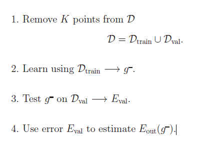
    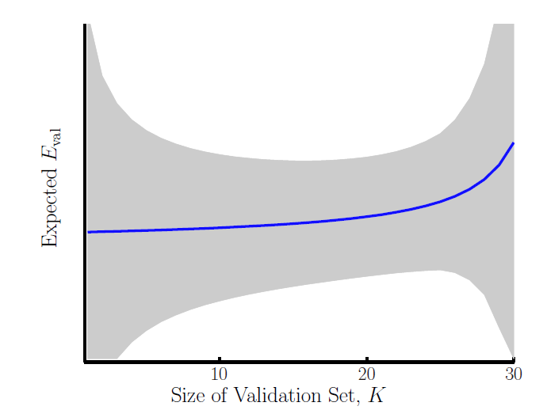
    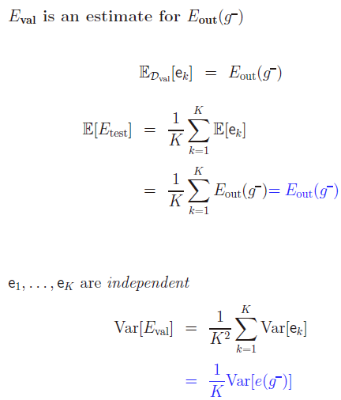
</figure>

#####Model selection

This could mean the choice between a linear model and a nonlinear model, the choice of the order of polynomial in a model, the choice of the value of a regularization parameter, or any other choice that affects the learning process.

It is now a simple matter to select the model with lowest validation error. Let $m^*$ be the index of the model which achieves the minimum validation error. So for $H_{m^*}$, $E_{m^*} \le E_{m}$ for $m= 1, ... ,M$. The model $H_{m^*}$ is the model selected based on the validation errors. Note that $E_{m^*}$ is no longer an unbiased estimate of $E_{out} (g_{m^*})$. Since we selected the model with minimum validation error, $E_{m^*}$ will have an optimistic bias. Then we have .

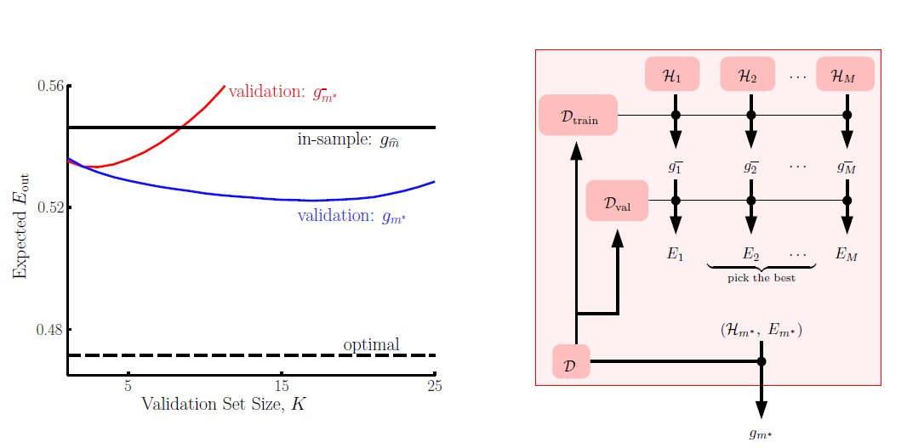

>Model with best $g$ also has best $g$ (leap of faith) We can find model with best $g$ using validation

#####Cross validation
Validation relies on the following chain of reasoning: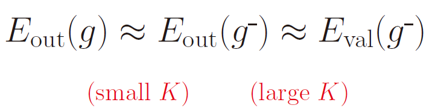  


>Theorem: $E_{cv}$ is an unbiased estimate of $E_{out}(N - 1)$ (the expectation of the model performance, $E[E_{out}]$, over data sets of size $N - 1$). We have 

10-Fold cross validations:
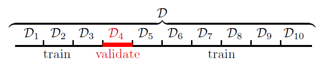

```
Cross validation for selecting A(lambda):
1: Define M models by choosing different values for A in the
   augmented error: (H, A1),H (H, A2), ... , (H, AM)
2: for each model m = 1, ... , M do
3:      Use the cross validation module in Figure 4.14 to estimate Ecv(m), the cross validation error for model m.
4: Select the model m* with minimum Ecv( m*).
5: Use model (H, Am*) and all the data D to obtain the final hypothesis gm*.Effectively, you have estimated the 
   optimal A.
```

<figure class="third">
    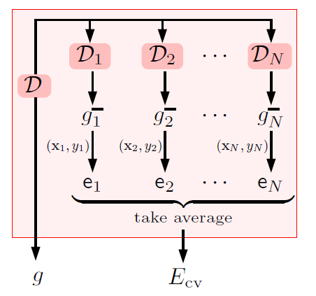
    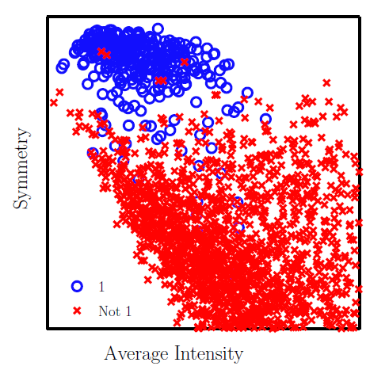
    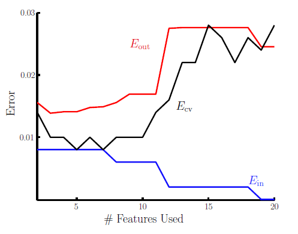
</figure>


###Conclusion

1. `Noise` (`stochastic` or `deterministic`) affects learning adversely, leading to overfitting.
2. `Regularization` helps to prevent `overfitting` by constraining the model, reducing the impact of the noise, while still giving us flexibility to fit the data.
3. `Validation` and `cross validation` are useful techniques for estimating $E_{out}$. One important use of validation is `model selection`, in particular to estimate the `amount of regularization` to use.
